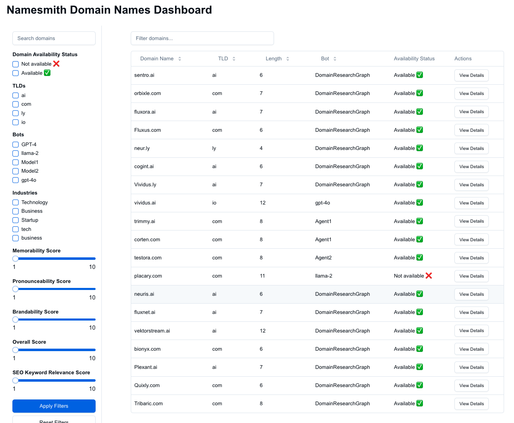

# Domain Name Investment Platform

This project is a multi-agent bot system using LangGraph to automate the generation, evaluation, and resale of high-quality, brandable domain names. The system includes a dashboard to view the output of the bots and their status.
[Project Documentation](https://coda.io/d/Domain-name-Bot-Agents-project_dfkJDNYF-UH)

Codebase for the agentic bot system is in the [namesmith-agents](https://github.com/sreenivasanac/namesmith_agents) github repo.

**Live Demo**: [Namesmith Console Dashboard](https://namesmith-console-qjzx.vercel.app/dashboard)

- [Project Demo of Agents in action -- Youtube](https://www.youtube.com/watch?v=hF3eGLudxY4&list=PLB1nTQo4_y6u_4vzapND6Bm6J7M1KVurF&index=7)


## Features

- View and manage domain names with comprehensive details:
  - Basic domain information (name, TLD, length)
  - Availability status tracking
  - Domain evaluation metrics (memorability, pronounceability, brandability)
  - SEO analysis with keyword relevance and industry metrics
- Advanced filtering capabilities:
  - Filter by status, TLD, bot, and industry
  - Range-based filters for evaluation scores
  - Full-text domain name search
- Detailed domain information sheets with:
  - Evaluation metrics and scores
  - SEO analysis data
  - Availability status
  - Agent processing details
- Pagination for efficient data handling
- API endpoints for bot integration

## Tech Stack

- **Framework**: Next.js 14 with App Router
- **Language**: TypeScript
- **Database**: 
  - PostgreSQL via Supabase
  - Prisma ORM for database management
- **UI Components**: 
  - shadcn/ui
  - Tailwind CSS
  - Lucide icons
- **State Management**: Server components with minimal client state

## API Endpoints

- `/api/domains` - Domain management
- `/api/availability-status` - Status tracking
- `/api/evaluation` - Domain evaluation
- `/api/seo-analysis` - SEO analysis
- `/api/filters` - Filter options

## Dashboard screenshot



## Getting Started

### Prerequisites

- Node.js (v18 or later)
- npm or yarn
- PostgreSQL database (Supabase)

### Installation

1. Clone the repository:
   ```
   git clone https://github.com/sreenivasanac/namesmith_console
   cd namesmith_console
   ```

2. Install dependencies:
   ```
   npm install
   ```

3. Set up environment variables:
   Create a `.env` file with:
   ```
   DATABASE_URL="your_database_url_here"
   DIRECT_URL="your_direct_url_here"
   NEXT_PUBLIC_SUPABASE_URL="your_supabase_url_here"
   NEXT_PUBLIC_SUPABASE_ANON_KEY="your_anon_key_here"
   NEXT_PUBLIC_BASE_URL=http://localhost:3000
   ```

4. Initialize the database:
   ```
   npx prisma generate
   npx prisma migrate dev
   npx prisma db seed
   ```

5. Start the development server:
   ```
   npm run dev
   ```

## Database Schema

- **DomainName**: Core domain information
- **DNAvailabilityStatus**: Domain availability tracking
- **DNEvaluation**: Comprehensive domain evaluation metrics
- **DNSEOAnalysis**: SEO and market analysis data

## Development Guidelines

- Follow TypeScript best practices
- Use server components by default
- Handle errors with proper logging
- Implement early returns for error conditions
- Use proper type definitions from `@/types/domain`

## Scripts

- `npm run dev` - Development server
- `npm run build` - Production build
- `npm run start` - Start production server
- `npx prisma studio` - Database management UI
- `npx prisma migrate dev` - Run migrations
- `npx prisma db seed` - Seed database

## Contributing

1. Fork the repository
2. Create your feature branch
3. Commit your changes
4. Push to the branch
5. Create a Pull Request

## License

[Add License Information]
